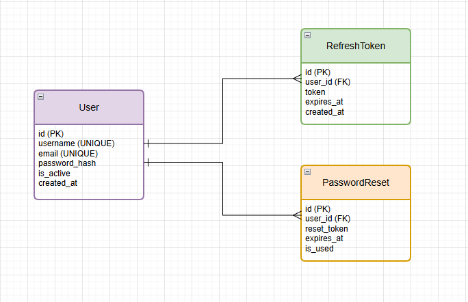

### Вариант №1. Сервис аутентификации (Auth)

#### Регистрация пользователя

Информация требуемая для регистрации пользователя

| Параметр | Обязательность | Тип    | Ограничение              | Значение по умолчанию |
|----------|----------------|--------|--------------------------|-----------------------|
| username | Обязательно    | Строка | Уникальное, не пустое    | —                     |
| email    | Обязательно    | Строка | Уникальная, формат email | —                     |
| password | Обязательно    | Строка | не менее 8 символов      | —                     |

Каждый параметр должен быть нукальный: username и email.

Выходные данные

| Параметр | Тип    |
|----------|--------|
| id       | Целое  |
| username | Строка |
| email    | Строка |

#### Вход пользователя (логин)

Входные параметры

| Параметр | Обязательность | Тип    | Ограничение        | Значение по умолчанию |
|----------|----------------|--------|--------------------|-----------------------|
| username | Обязательно    | Строка | Существует в БД    | —                     |
| password | Обязательно    | Строка | Соответствует хешу | —                     |

Выходные данные

| Параметр      | Тип    | Описание                                                                                                            |
|---------------|--------|---------------------------------------------------------------------------------------------------------------------|
| access_token  | Строка | JWT токен доступа. Время жизни — 15 минут. Содержит `user_id` и `username`. Не хранится в БД.                       |
| refresh_token | Строка | Токен обновления (UUID4). Время жизни — 7 дней. Сохраняется в таблице `RefreshToken` и связывается с пользователем. |

#### Обновление access токена

Входные параметры

| Параметр      | Обязательность | Тип    | Ограничение        | Значение по умолчанию |
|---------------|----------------|--------|--------------------|-----------------------|
| refresh_token | Обязательно    | Строка | Действующий токен  | —                     |

Выходные данные

| Параметр     | Тип    |
|--------------|--------|
| access_token | Строка |

#### Сброс пароля (запрос)

Информация требуемая для создания запроса на сброс пароля

| Параметр | Обязательность | Тип    | Ограничение        | Значение по умолчанию |
|----------|----------------|--------|--------------------|-----------------------|
| email    | Обязательно    | Строка | Существует в БД    | —                     |

Выходные данные

| Параметр | Тип    | Описание                                    |
|----------|--------|---------------------------------------------|
| message  | Строка |Текст результата для отображения пользователю|

#### Сброс пароля (подтверждение)

Входные параметры

| Параметр     | Обязательность | Тип    | Ограничение              | Значение по умолчанию |
|--------------|----------------|--------|--------------------------|-----------------------|
| reset_token  | Обязательно    | Строка | Действующий токен        | —                     |
| new_password | Обязательно    | Строка | не менее 8 символов      | —                     |

Выходные данные

| Параметр | Тип    |
|----------|--------|
| message  | Строка |

### ER-диаграмма

