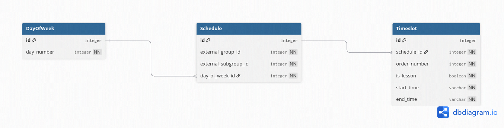

## Вариант №22. Сервис временных слотов (Timeslot)

### Функционал сервиса

Сервис хранит расписание занятий и перемен (начало/конец) для **учебных групп и подгрупп** в разные дни недели.  
Дни недели задаются числами от 1 до 7.  
Подгруппы могут иметь собственное расписание (например, для разных языков или физкультуры).

**Зависимости от других сервисов (заглушки):**
- `Group Service` (уровень 2) – идентификаторы групп.
- `Subgroup Service` (уровень 2) – идентификаторы подгрупп. Значение `0` означает основную группу.

**Внутренние сущности:**
- `Schedule` – расписание для пары (группа, подгруппа) в конкретный день недели.
- `Timeslot` – временные слоты (занятие или перемена) внутри расписания.

### Список функций

#### Добавить Schedule
**Информация требуемая для создания Schedule представлена в виде таблицы:**

| Параметр | Обязательность | Тип | Ограничение | Значение по умолчанию |
| :--- | :--- | :--- | :--- | :--- |
| group_id | Обязательно | Целое | 1 - 20 (существующая группа) | — |
| subgroup_id | Обязательно | Целое | 0 - основная группа, 1 - 50 — подгруппа | — |
| day_of_week | Обязательно | Целое | 1 - 7 (день недели) | — |

Уникальные комбинации параметров: (group_id, subgroup_id, day_of_week).

**Информация возвращаемая в случае удачного создания Schedule:**

| Параметр | Тип |
| :--- | :--- |
| id | Целое |
| group_id | Целое |
| subgroup_id | Целое |
| day_of_week | Целое |

#### Изменить Schedule по ID
**Информация требуемая для изменения Schedule по ID представлена в виде таблицы:**

| Параметр | Обязательность | Тип | Ограничение | Значение по умолчанию |
| :--- | :--- | :--- | :--- | :--- |
| group_id | Опционально | Целое | - | — |
| subgroup_id | Опционально | Целое | - | — |
| day_of_week | Опционально | Целое | 1 - 7 | — |

**Информация возвращаемая в случае удачного изменения Schedule:**

| Параметр | Тип |
| :--- | :--- |
| id | Целое |
| group_id | Целое |
| subgroup_id | Целое |
| day_of_week | Целое |

#### Удаление Schedule по ID
Вернет True, если Schedule была закрыта (удалена), иначе вернет False.

#### Получить Schedule по ID
**Информация возвращаемая в случае удачного поиска Schedule по ID:**

| Параметр | Тип |
| :--- | :--- |
| id | Целое |
| group_id | Целое |
| subgroup_id | Целое |
| day_of_week | Целое |

#### Получить список Schedule по заданным параметрам
**Информация требуемая для получения списка Schedule:**

| Параметр | Тип | Описание |
| :--- | :--- | :--- |
| group_id | Целое | Идентификатор группы для фильтрации |
| subgroup_id | Целое | Идентификатор подгруппы для фильтрации |
| day_of_week | Целое | День недели для фильтрации |

**Информация возвращается в виде списка Schedule:**

| Параметр | Тип |
| :--- | :--- |
| id | Целое |
| group_id | Целое |
| subgroup_id | Целое |
| day_of_week | Целое |

---

#### Добавить Timeslot
**Информация требуемая для создания Timeslot представлена в виде таблицы:**

| Параметр | Обязательность | Тип | Ограничение | Значение по умолчанию |
| :--- | :--- | :--- | :--- | :--- |
| schedule_id | Обязательно | Целое | Существующий ID Schedule | — |
| order_number | Обязательно | Целое | Положительное число (> 0) | — |
| is_lesson | Обязательно | Логический | True — занятие, False — перемена | — |
| start_time | Обязательно | Время | Формат HH:MM:SS, меньше end_time | — |
| end_time | Обязательно | Время | Формат HH:MM:SS, больше start_time | — |

**Уникальные комбинации параметров:** (schedule_id, order_number).

Информация возвращаемая в случае удачного создания Timeslot:

| Параметр | Тип |
| :--- | :--- |
| id | Целое |
| schedule_id | Целое |
| order_number | Целое |
| is_lesson | Логический |
| start_time | Время |
| end_time | Время |

#### Изменить Timeslot по ID
**Информация требуемая для изменения Timeslot по ID представлена в виде таблицы:**

| Параметр | Обязательность | Тип | Ограничение | Значение по умолчанию |
| :--- | :--- | :--- | :--- | :--- |
| schedule_id | Опционально | Целое | Существующий ID Schedule | — |
| order_number | Опционально | Целое | Положительное число | — |
| is_lesson | Опционально | Логический | — | — |
| start_time | Опционально | Время | Меньше end_time | — |
| end_time | Опционально | Время | Больше start_time | — |

**Информация возвращаемая в случае удачного изменения Timeslot:**

| Параметр | Тип |
| :--- | :--- |
| id | Целое |
| schedule_id | Целое |
| order_number | Целое |
| is_lesson | Логический |
| start_time | Время |
| end_time | Время |

#### Удаление Timeslot по ID
Вернет True, если Timeslot была закрыта (удалена), иначе вернет False.

#### Получить Timeslot по ID
**Информация возвращаемая в случае удачного поиска Timeslot по ID:**

| Параметр | Тип |
| :--- | :--- |
| id | Целое |
| schedule_id | Целое |
| order_number | Целое |
| is_lesson | Логический |
| start_time | Время |
| end_time | Время |

#### Получить список Timeslot по заданным параметрам
**Информация требуемая для получения списка Timeslot:**

| Параметр | Тип | Описание |
| :--- | :--- | :--- |
| schedule_id | Целое | Фильтр по родительскому расписанию |
| group_id | Целое | Фильтр по группе |
| subgroup_id | Целое | Фильтр по подгруппе |
| day_of_week | Целое | Фильтр по дню недели |
| order_number | Целое | Фильтр по номеру слота |
| is_lesson | Логический | Фильтр по типу (занятие/перемена) |

**Информация возвращается в виде списка Timeslot:**

| Параметр | Тип |
| :--- | :--- |
| id | Целое |
| schedule_id | Целое |
| order_number | Целое |
| is_lesson | Логический |
| start_time | Время |
| end_time | Время |

### ER-диаграмма

